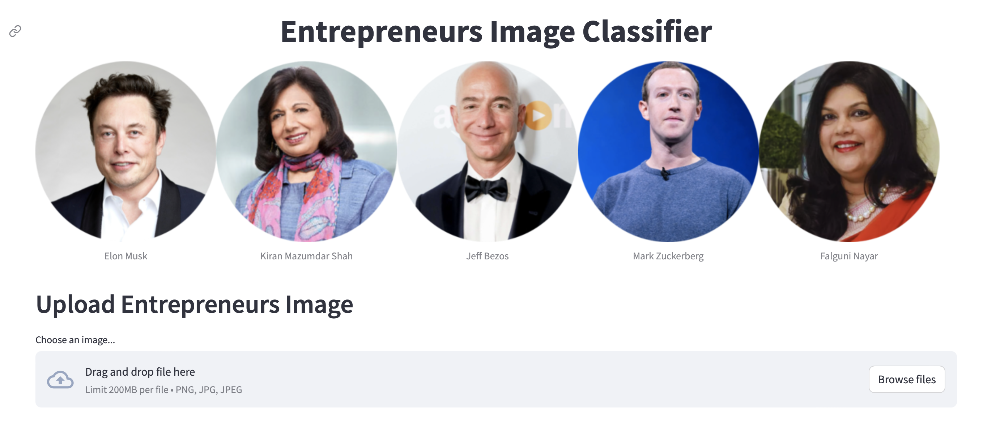
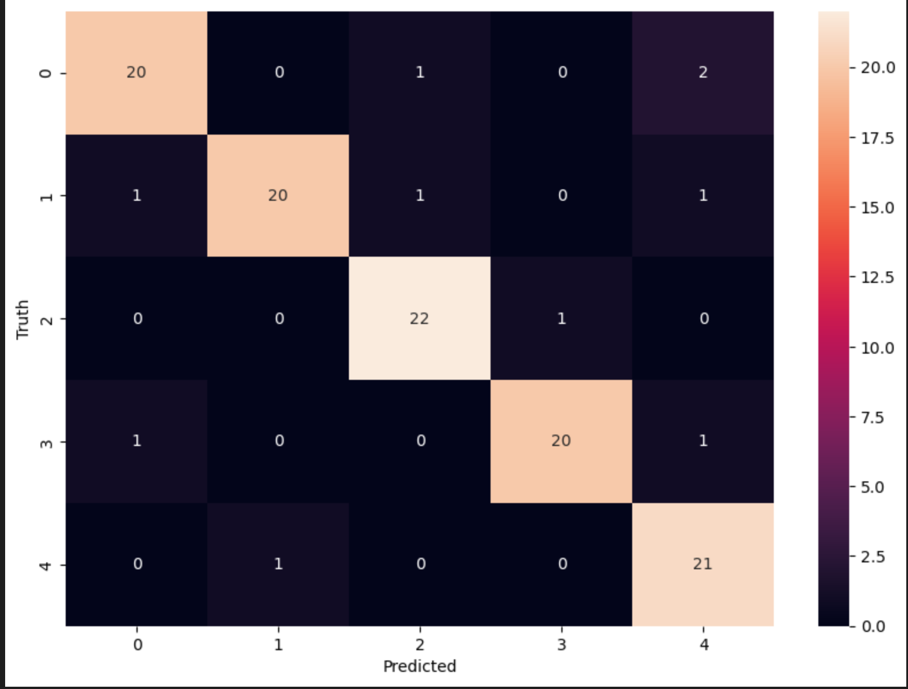

# Entrepreneurs Image Classifier

## Table of Contents
- [Project Overview](#project-overview)
- [Data Source](#data-source)
- [Website Link](#website-link)
- [Implementation Details](#implementation-details)
    - [Methods Used](#methods-used)
    - [Technologies](#technologies)
    - [Python Packages Used](#python-packages-used)
- [Steps Followed](#steps-followed)
- [Results and Evaluation Criterion](#results-and-evaluation-criterion)
- [Future Improvements](#future-improvements)

  
## Project Overview
This project focuses on creating an image classification model to classify images of five entrepreneurs collected from the internet. The goal is to develop a model that can accurately identify and classify the images of these entrepreneurs. 

## Data Source
The dataset used for this project was collected from the Internet, specifically using the 'Fatkun Batch Download Image', Google chrome extension. This extension facilitated the collection of diverse images featuring various entrepreneurs, providing a rich and comprehensive dataset for the project.

## Website Link

A web-based demonstration of the image classification can be accessed from this [link](https://entrepreneurs-image-classifier.streamlit.app).

## Implementation Details

### Methods Used
* Deep Learning
* Convulational Neural Network
* Haarcascades
* Image Classification
* Data Collection

### Technologies
* Python
* Jupyter
* streamlit

### Python Packages Used
* Pandas
* tensorflow
* keras
* opencv
* Pillow

## Steps Followed

1. Data Collection: A dataset was collected from the internet, capturing images of various individuals, including the five specific entrepreneurs of interest.
2. Data Preprocessing: The collected images underwent preprocessing steps. The Haar Cascade face detection algorithm was applied to extract faces from the images. These face images were manually verified, ensuring that only the faces of the five entrepreneurs remained, removing any other individuals. Additionally, poor quality images were eliminated to enhance data quality.
3. Data Formatting: The preprocessed images were then converted into a format suitable for input into neural networks, ensuring compatibility and efficient processing.
4. Balancing the Dataset: As the dataset might have been imbalanced with varying numbers of images for each entrepreneur, the SMOTE (Synthetic Minority Over-sampling Technique) algorithm was utilized to balance the dataset, generating synthetic samples to augment the minority class.
5. Training with Convolutional Neural Networks (CNN): The preprocessed and balanced dataset was used to train a CNN model, leveraging its ability to learn intricate features and patterns in images.
6. Validation and Accuracy: The trained model was evaluated on a separate test set to assess its performance. Achieving over 95% accuracy, the model demonstrated its effectiveness in accurately classifying the images of the five entrepreneurs.
7. Web App Development: A web application was created using Streamlit, enabling users to upload images and receive responses identifying the individuals in the images, thereby providing a user-friendly interface to interact with the image classification model.

## Results and Evaluation Criterion

Based on the evaluation results, the best-performing model was **XGBoost** with R2 score of **0.82**

## Future Improvements

Here are some potential areas for future improvements in the project:

* Incorporate more features related to delivery partners, weather conditions, or traffic patterns to enhance prediction accuracy.
* Conduct more comprehensive data analysis to identify additional patterns or correlations that can contribute to better predictions.
* Fine-tune the model parameters to potentially improve performance.

